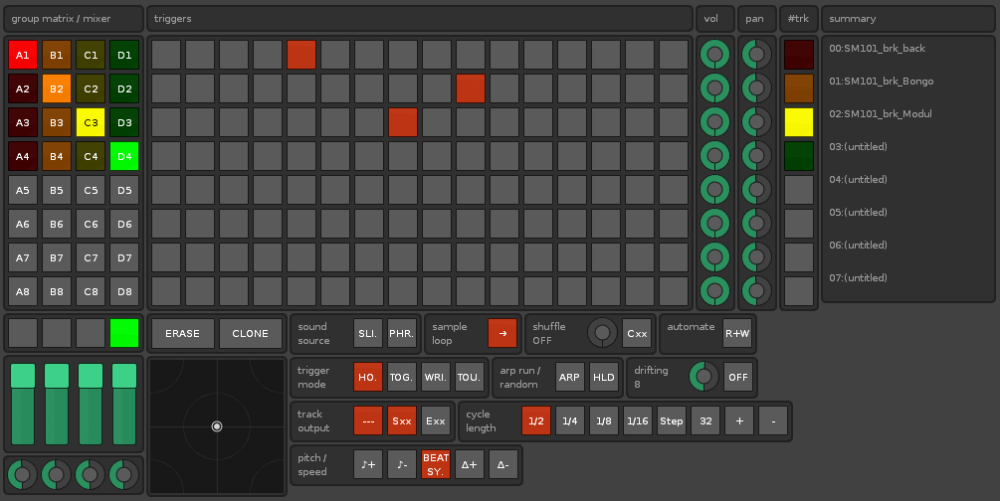

# Duplex.Applications.Mlrx

< Back to [Applications](../Applications.md)

## About

Mlrx is a live performance loop sequencer for Renoise, inspired by mlr by tehn. 
It comes with a comprehensive set of features:

* Independantly playing samples and/or phrases in any tempo
* Can use samples, sliced samples and phrases as the sound source
* A huge amount of triggering modes and options can be defined per track
* All options are embedded in the song itself and restored between sessions
* "Streaming" output means seamless transitions between patterns, loops
* Record everything into patterns or phrases (create from scratch)
* Use an additional MIDI controller for transposing & triggering

Tool discussion is located on the [Renoise forum](http://forum.renoise.com/index.php?/topic/38924-new-tool-30-mlrx/)

## Example configuration 

  
*mrlx running on the monome128*

## Available mappings
  
| Name       | Description   |
| -----------|---------------|  
|`arp_mode`|Mlrx: Set arpeggiator mode ALL = pick random offset from all triggers RND = pick random offset among held triggers FW  = step through held triggers, order of arrival 4TH = pick random offset (in step of four) from most recent trigger 4TH = pick random offset (in step of two) from most recent trigger|  
|`automation`|Mlrx: Automation mode READ = Only display automation data READ + WRITE = Display automation, record when moved WRITE = Start recording from the moment a parameter is moved|  
|`clone`|Mlrx: Press to create a duplicate of the current pattern|  
|`decrease_cycle`|Mlrx: Decrease cycle length|  
|`drift_amount`|Mlrx: Set drift amount (between -256 and 256)|  
|`drift_enable`|Mlrx: Select drifting mode OFF = do not apply drift '*' = apply drift using entire sample '/' = apply drift using cycle range|  
|`drift_label`|Mlrx: Display drifting info|  
|`erase`|Mlrx: Press to erase the entire pattern|  
|`group_levels`|Mlrx: Adjust velocity for each group|  
|`group_panning`|Mlrx: Adjust panning for each group|  
|`group_toggles`|Mlrx: Toggle group recording/mute state When blinking, press to stop recording When not blinking, press to toggle mute state|  
|`increase_cycle`|Mlrx: Increase cycle length|  
|`matrix`|Mlrx: Assign this track to group A/B/C/D|  
|`select_track`|Mlrx: Set the active track (hold the button and simultaneously press a group toggle-button to assign this track to that group)|  
|`set_cycle_16`|Mlrx: Set cycle length to a sixteenth|  
|`set_cycle_2`|Mlrx: Set cycle length to half|  
|`set_cycle_4`|Mlrx: Set cycle length to quarter|  
|`set_cycle_8`|Mlrx: Set cycle length to an eigth|  
|`set_cycle_custom`|Mlrx: Set cycle length to exact value|  
|`set_cycle_es`|Mlrx: Sync cycle length with Renoise edit-step|  
|`set_mode_hold`|Mlrx: Set track to HOLD mode (continously looping sound)|  
|`set_mode_toggle`|Mlrx: Set track to TOGGLE mode (continously looping & toggleable, clears existing data)|  
|`set_mode_touch`|Mlrx: Set track to TOUCH mode (produce output only while pressed)|  
|`set_mode_write`|Mlrx: Set track to WRITE mode (produce output only while pressed, clears existing data)|  
|`set_source_phrase`|Mlrx: Set source to PHRASE mode [Press] to toggle phrase playback for instrument [Hold] to capture pattern data into phrase (when stopped),  or start a phrase recording (when playing)|  
|`set_source_slice`|Mlrx: Set source to SLICE mode [Hold] to apply/remove slicing from selected sample|  
|`shuffle_amount`|Mlrx: Set shuffle amount (0-255)|  
|`shuffle_label`|Mlrx: Displays info about shuffle|  
|`tempo_down`|Mlrx: Tempo down [Press] to decrease by a single tempo/LPB [Hold] to halve current tempo (when possible)|  
|`tempo_up`|Mlrx: Tempo up [Press] to increase by a single tempo/LPB [Hold] to double current tempo (when possible)|  
|`toggle_arp`|Mlrx: Toggle arpeggiator on/off|  
|`toggle_exx_output`|Mlrx: Toggle output of envelope offset commands|  
|`toggle_loop`|Mlrx: Enable/disable sample loop|  
|`toggle_note_output`|Mlrx: Toggle output of notes|  
|`toggle_shuffle_cut`|Mlrx: Enable/disable shuffle cut (Cxx)|  
|`toggle_sxx_output`|Mlrx: Toggle output of sample offset commands|  
|`toggle_sync`|Mlrx: Enable 'beat-sync' in instrument|  
|`track_labels`|Mlrx: Display information about this track|  
|`track_levels`|Mlrx: Adjust velocity for each track|  
|`track_panning`|Mlrx: Adjust panning for each track|  
|`transpose_down`|Mlrx: Transpose down [Press] to transpose by a single semitone [Hold] to transpose by an octave|  
|`transpose_up`|Mlrx: Transpose up [Press] to transpose by a single semitone [Hold] to transpose by an octave|  
|`triggers`|Mlrx: Sample trigger|  
|`xy_pad`|Mlrx: XY-Pad input|  

## Default options 
  
> Can be overridden in [configurations](../Configurations.md)

| Name          | Description   |
| ------------- |---------------|  
|`active_track`|Determine how to select the active mlrx-track|  
|`automation`|Select automation mode|  
|`collapse_tracks`|Determine if tracks in the pattern editor should be collapsed|  
|`group_panning`|Choose input for controlling the active group panning|  
|`group_velocity`|Choose input for controlling the active group velocity|  
|`midi_controller`|Specify a MIDI controller for transpose & triggering|  
|`play_on_trig`|Determine how to handle playback & recording|  
|`sample_prep`|Determine how to handle newly added samples|  
|`set_focus`|Determine how focus in Renoise follows the active mlrx-track|  
|`track_panning`|Choose input for controlling the active track panning|  
|`track_velocity`|Choose input for controlling the active track velocity|  

## Default palette 
  
> Can be overridden in [configurations](../Configurations.md)

| Name          | Color|Text|Value|
| ------------- |------|----|-----|  
|`disabled`|
0x00,0x00,0x00
||false|  
|`enabled`|
0xFF,0xFF,0xFF
||true|  
|`group_a_dimmed`|
0x40,0x00,0x00
||true|  
|`group_a`|
0xFF,0x00,0x00
||true|  
|`group_b_dimmed`|
0x80,0x40,0x00
||true|  
|`group_b`|
0xFF,0x80,0x00
||true|  
|`group_c_dimmed`|
0x40,0x40,0x00
||true|  
|`group_c`|
0xFF,0xFF,0x00
||true| 
|`group_d_dimmed`|
0x00,0x40,0x00
||true|  
|`group_d`|
0x00,0xFF,0x00
||true|  
|`group_default_off`|
0x70,0x70,0x70
||false|  
|`group_default`|
0xFF,0xFF,0xFF
||true|  
|`master_group`|
0x36,0x36,0x36
||nil|  

## Changelog

1.01
- Tool-dev: use cLib/xLib libraries, refactored some code
- High-res automation recording (interleaved or punch-in)

0.99.1
- Realtime recording into phrases

0.99
- Many new features, better integration with Renoise

0.98
- First release 

